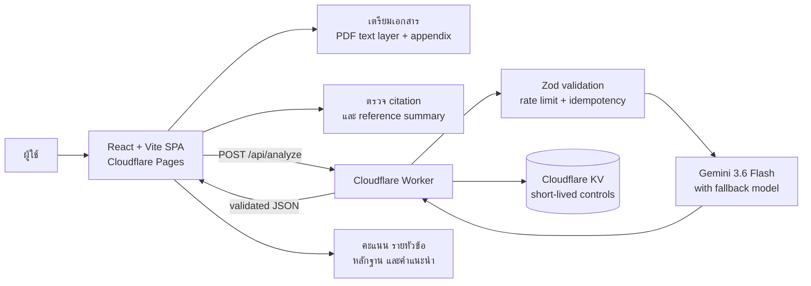

# RubricLens AI

> ตรวจเอกสารให้ครบ ชัด และตรงเกณฑ์ ด้วย React, Cloudflare Workers และ Gemini

[](https://reportcheckxd.pages.dev/)
[](docs/testing-report.md)


## Project overview

RubricLens AI เป็น single-page web app สำหรับตรวจเอกสารตามเกณฑ์เฉพาะประเภท ผู้ใช้เลือกระหว่างรายงานทั่วไป โครงงาน และรายงานวิจัย แล้ววางข้อความหรืออัปโหลด PDF เพื่อรับผลตรวจพร้อมเหตุผล หลักฐานที่พบ สิ่งที่อาจยังขาด และคำแนะนำใน workflow เดียว

โปรเจกต์นี้ออกแบบให้เป็น **ผู้ช่วยทบทวน ไม่ใช่ผู้ตัดสิน** ผลจาก AI จึงแสดงหลักฐาน สิ่งที่อาจขาด และคำแนะนำเพื่อให้ผู้ใช้ตรวจเทียบกับรายงานต้นฉบับอีกครั้ง

**Live demo:** [reportcheckxd.pages.dev](https://reportcheckxd.pages.dev/)

## Why this project is interesting

- แยกรายงานทั่วไป โครงงาน และรายงานวิจัยด้วย rubric และบริบท AI ที่ต่างกันจริง
- ทำให้การตรวจเอกสารที่ต้องอ่านซ้ำหลายส่วนกลายเป็น flow ที่สั้นและอธิบายได้
- แยกการคำนวณคะแนนไว้ในโค้ด ไม่ปล่อยให้โมเดลคำนวณคะแนนรวมเอง
- ป้องกันการส่งภาคผนวกโดยไม่ตั้งใจด้วย accessible confirmation dialog
- อ่าน PDF เฉพาะ text layer พร้อมแจ้งเตือน PDF สแกนและ PDF หลายคอลัมน์
- รองรับ rubric templates และ custom rubric พร้อม validation น้ำหนัก/หัวข้อ
- ออกแบบ failure paths ตั้งแต่ต้น: timeout, cancel, retry, quota, malformed AI response และ idempotency
- คำนวณคะแนนโดยไม่นับหัวข้อที่ไม่เกี่ยวข้องกับงาน และไม่แสดง 0% ที่ทำให้เข้าใจผิดเมื่อไม่มีหัวข้อให้ประเมิน
- วิเคราะห์เอกสารยาวแบบสองขั้น: อ่านทีละส่วน แล้วสรุปรวมทั้งเอกสารจาก structured findings
- ป้องกันการส่งซ้ำด้วย idempotency ที่ผูกกับ digest ของคำขอ ไม่ใช่แค่ key
- มี automated quality gate ตั้งแต่ unit test ถึง cross-browser E2E บน production build จริง

## Architecture



### Request lifecycle

1. Frontend รับข้อความหรือ extract text layer จาก PDF ก่อนส่ง
2. ระบบตรวจขนาดเอกสาร, appendix, references และ rubric ใน browser
3. เมื่อผู้ใช้ยืนยัน จึงส่งเนื้อหาหลักไปยัง Worker
4. Worker ตรวจ request ด้วย Zod, คุม rate limit/idempotency และเรียก Gemini
5. Worker ตรวจ schema ของ AI response, บังคับกฎหัวข้อที่ไม่เกี่ยวข้อง และ **คำนวณคะแนนรวมด้วยโค้ดฝั่ง Worker**
6. Frontend ตรวจ `apiVersion` และ schema ของผลก่อนแสดง แล้วจัดลำดับ “สิ่งที่ควรแก้ก่อนส่ง” จากหัวข้อที่เกี่ยวข้องเท่านั้น

> คะแนนรวมของ API จริงคำนวณใน Worker ส่วน browser คำนวณคะแนนเองเฉพาะตอนใช้ mock analysis ใน local development ทั้งสองเส้นทางใช้สูตรเดียวกันจาก `shared/scoring.ts`

รายละเอียดเพิ่มเติมอยู่ใน [docs/architecture.md](docs/architecture.md)

## Key user flows

| Flow | สิ่งที่ผู้ใช้ทำ | สิ่งที่ระบบรับประกัน |
| --- | --- | --- |
| Text report | วางข้อความแล้วกดตรวจ | ป้องกันข้อความว่าง/ยาวเกิน และแสดง progress |
| PDF report | อัปโหลด PDF | preview text layer, แจ้ง scanned PDF และอ่านหลายคอลัมน์อย่างระมัดระวัง |
| Appendix | พบหัวข้อภาคผนวก | ต้องยืนยันผ่าน dialog ก่อนส่ง และยกเลิกได้โดยไม่ส่งข้อมูล |
| Rubric editor | เลือก template หรือแก้หัวข้อ | validate title, criteria, enabled state และ weight |
| Result review | ดูคะแนนและหลักฐาน | score คำนวณด้วยโค้ด พร้อม copy/download ผลตรวจ |
| Irrelevant criteria | หัวข้อที่ไม่ตรงกับลักษณะงาน | แสดง badge “ไม่เกี่ยวข้อง” แทนคะแนน และไม่นับน้ำหนักในตัวหาร |

## Tech stack

- **Frontend:** React 19, TypeScript, Vite, Tailwind CSS, shadcn-style UI
- **Document processing:** PDF.js, text-layer extraction, appendix detection
- **Backend:** Cloudflare Worker, Zod, Cloudflare KV
- **AI:** Google Gemini ผ่าน Worker เท่านั้น; API key ไม่อยู่ใน frontend
- **Testing:** Vitest, React Testing Library, Playwright, oxlint และ TestSprite CLI
- **Hosting:** Cloudflare Pages + Cloudflare Workers

## Quality and verification

### Local verification (2 สิงหาคม 2026)

| Check | Result |
| --- | ---: |
| `npm run lint` | passed |
| `npm run test` | 115/115 passed |
| `npm run worker:check` | passed |
| `npm run audit:prod` | 0 vulnerabilities |
| `npm run build` | passed |
| `npm run test:e2e` | 72/72 passed |

E2E รันบน output ของ `npm run build` ผ่าน `vite preview` ครอบคลุม Chromium, Mobile Chrome, Firefox และ WebKit

### Production verification

production ยังเสิร์ฟ build รุ่นก่อนหน้า การเปลี่ยนแปลงล่าสุดจึงยังไม่ได้ verify บน production URL และผล TestSprite ที่บันทึกไว้เป็นของ build รุ่นก่อน ไม่ใช่หลักฐานของโค้ดปัจจุบัน

อ่านรายละเอียด test cases, scope และข้อจำกัดได้ที่ [docs/testing-report.md](docs/testing-report.md)

## Local development

### Requirements

- Node.js 24+
- npm

### Install and run

```bash
npm install
copy .env.example .env
npm run dev
```

เปิด `http://localhost:5173` แล้วใช้ข้อความสังเคราะห์สำหรับทดสอบ Local development จะใช้ mock analysis เป็นค่าเริ่มต้นเมื่อไม่มี production environment variables

### Verify locally

```bash
npm run verify
```

`npm run verify` รันชุดเดียวกับ CI คือ lint, unit tests, worker dry-run, production dependency audit และ production-preview E2E หรือรันแยกทีละขั้น:

```bash
npm run lint
npm run test
npm run worker:check
npm run audit:prod
npm run test:e2e
```

`npm run test:e2e` build ใหม่เสมอแล้วทดสอบ output นั้นผ่าน `vite preview` ถ้า build ไว้แล้วและอยากรันเฉพาะ Playwright ให้ใช้ `npm run test:e2e:only`

### Worker development

```bash
npx wrangler secret put GEMINI_API_KEY
npm run worker:dev
```

ห้ามใส่ Gemini key ใน `VITE_*`, `.env`, source code หรือ commit history ดูแนวทางเพิ่มเติมใน [SECURITY.md](SECURITY.md)

## Deployment

ลำดับการ deploy สำคัญ: **compatibility Worker ก่อน แล้วจึง Pages** Worker รองรับ v0 shape สำหรับ Pages เดิมและ v1 ผ่าน `X-RubricLens-Api-Version` สำหรับ Pages ใหม่ จึงไม่มีช่วง contract error

```text
Worker dry-run -> Worker deploy -> health/contract smoke -> Pages deploy -> browser smoke -> TestSprite
```

ขั้นตอนเต็ม คำสั่ง และวิธี rollback ทั้ง Worker และ Pages อยู่ใน [docs/deployment-runbook.md](docs/deployment-runbook.md)

Worker ใช้ `wrangler.jsonc` เป็น source of truth สำหรับ model, KV binding และ non-secret variables ส่วน `GEMINI_API_KEY` ต้องเก็บใน Worker Secret เท่านั้น

## Repository map

```text
shared/              API contract, scoring formula และ document type definitions ที่ใช้ร่วมกันสองฝั่ง
src/                 React app, UI state และ domain logic
worker/              Cloudflare Worker API และ server-side validation
e2e/                 Playwright flows บน desktop/mobile/browser engines
public/              static assets, headers, sitemap และ social preview
.testsprite/         project config, 10 plans และ custom mobile test code
docs/                architecture, deployment runbook, test report และ archived notes
.github/workflows/   CI quality gate
```

## Security and privacy

- API key อยู่ใน Cloudflare Worker Secret ไม่ใช่ browser bundle
- Worker รับ JSON เท่านั้น ตรวจ request size และ schema ก่อนประมวลผล
- ไม่ log เนื้อหารายงานโดยเจตนา และไม่เก็บไฟล์ต้นฉบับถาวร
- session draft เก็บเฉพาะใน `sessionStorage` ของแท็บ
- KV ใช้สำหรับ rate-limit/idempotency และผลสำเร็จอายุสั้น (10 นาที) เท่านั้น
- ผลที่ cache ไว้อาจมีข้อความอ้างอิงสั้น ๆ ที่ AI ยกมา แต่ไม่มีเอกสารต้นฉบับฉบับเต็มหรือไฟล์ที่อัปโหลด
- ระบบเตือนผู้ใช้ว่า AI อาจคลาดเคลื่อนและต้องตรวจเทียบกับต้นฉบับ

อ่านรายละเอียดได้ที่ [SECURITY.md](SECURITY.md)

## Portfolio talking points

ใช้ bullet เหล่านี้อธิบายโปรเจกต์ในการสมัครงานได้:

- Built a production-deployed AI report review workflow with React, TypeScript, Cloudflare Workers and Gemini.
- Designed schema-first AI integration with Zod validation, retry/fallback handling and code-owned score calculation.
- Built a two-stage consolidation pass so long documents are judged as a whole from structured findings instead of by taking the best-scoring chunk.
- Versioned the client/server contract and made idempotency payload-aware so a replayed key can never return a different document's result.
- Implemented robust document UX for Thai text, PDF text layers, appendix confirmation and configurable rubrics.
- Established a quality pipeline of 106 unit tests plus 72 cross-browser E2E tests that run against the real production build served by `vite preview`, gated in CI alongside a Worker dry-run and a production dependency audit.
- Kept secrets server-side and documented rate limits, idempotency, privacy boundaries and deployment operations.

## Project status

This is a portfolio/MVP project. AI output is advisory and does not certify academic correctness, plagiarism status, or compliance with a course rubric.
