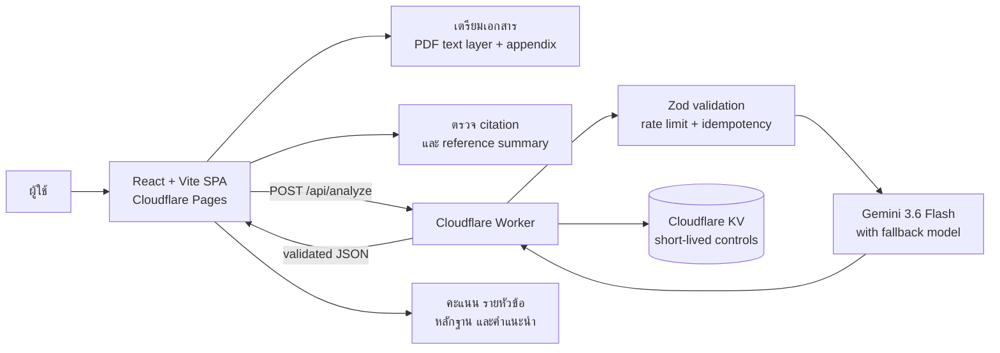

# AI Report Check

> ผู้ช่วยตรวจความครบถ้วนของโครงงานและรายงานก่อนส่ง ด้วย React, Cloudflare Workers และ Gemini

[](https://reportcheckxd.pages.dev/)
[](docs/testing-report.md)


## Project overview

AI Report Check เป็น single-page web app สำหรับช่วยทบทวนรายงานก่อนส่ง ผู้ใช้วางข้อความหรืออัปโหลด PDF แล้วตรวจหัวข้อสำคัญ เช่น บทนำ วัตถุประสงค์ วิธีดำเนินงาน ผลลัพธ์ การอ้างอิง และภาคผนวกได้ใน workflow เดียว

โปรเจกต์นี้ออกแบบให้เป็น **ผู้ช่วยทบทวน ไม่ใช่ผู้ตัดสิน** ผลจาก AI จึงแสดงหลักฐาน สิ่งที่อาจขาด และคำแนะนำเพื่อให้ผู้ใช้ตรวจเทียบกับรายงานต้นฉบับอีกครั้ง

**Live demo:** [reportcheckxd.pages.dev](https://reportcheckxd.pages.dev/)

## Why this project is interesting

- ทำให้การตรวจรายงานที่ต้องอ่านซ้ำหลายส่วนกลายเป็น flow ที่สั้นและอธิบายได้
- แยกการคำนวณคะแนนไว้ในโค้ด ไม่ปล่อยให้โมเดลคำนวณคะแนนรวมเอง
- ป้องกันการส่งภาคผนวกโดยไม่ตั้งใจด้วย accessible confirmation dialog
- อ่าน PDF เฉพาะ text layer พร้อมแจ้งเตือน PDF สแกนและ PDF หลายคอลัมน์
- รองรับ rubric templates และ custom rubric พร้อม validation น้ำหนัก/หัวข้อ
- ออกแบบ failure paths ตั้งแต่ต้น: timeout, cancel, retry, quota, malformed AI response และ idempotency
- มี automated quality gate ตั้งแต่ unit test ถึง browser E2E และ TestSprite บน production URL

## Architecture



### Request lifecycle

1. Frontend รับข้อความหรือ extract text layer จาก PDF ก่อนส่ง
2. ระบบตรวจขนาดเอกสาร, appendix, references และ rubric ใน browser
3. เมื่อผู้ใช้ยืนยัน จึงส่งเนื้อหาหลักไปยัง Worker
4. Worker ตรวจ request ด้วย Zod, คุม rate limit/idempotency และเรียก Gemini
5. Worker ตรวจ schema ของ AI response ก่อนส่งกลับ
6. Frontend คำนวณคะแนนรวมและจัดลำดับ “สิ่งที่ควรแก้ก่อนส่ง” ด้วยโค้ด

รายละเอียดเพิ่มเติมอยู่ใน [docs/architecture.md](docs/architecture.md)

## Key user flows

| Flow | สิ่งที่ผู้ใช้ทำ | สิ่งที่ระบบรับประกัน |
| --- | --- | --- |
| Text report | วางข้อความแล้วกดตรวจ | ป้องกันข้อความว่าง/ยาวเกิน และแสดง progress |
| PDF report | อัปโหลด PDF | preview text layer, แจ้ง scanned PDF และอ่านหลายคอลัมน์อย่างระมัดระวัง |
| Appendix | พบหัวข้อภาคผนวก | ต้องยืนยันผ่าน dialog ก่อนส่ง และยกเลิกได้โดยไม่ส่งข้อมูล |
| Rubric editor | เลือก template หรือแก้หัวข้อ | validate title, criteria, enabled state และ weight |
| Result review | ดูคะแนนและหลักฐาน | score คำนวณด้วยโค้ด พร้อม copy/download ผลตรวจ |

## Tech stack

- **Frontend:** React 19, TypeScript, Vite, Tailwind CSS, shadcn-style UI
- **Document processing:** PDF.js, text-layer extraction, appendix detection
- **Backend:** Cloudflare Worker, Zod, Cloudflare KV
- **AI:** Google Gemini ผ่าน Worker เท่านั้น; API key ไม่อยู่ใน frontend
- **Testing:** Vitest, React Testing Library, Playwright, oxlint และ TestSprite CLI
- **Hosting:** Cloudflare Pages + Cloudflare Workers

## Quality and verification

| Check | Result |
| --- | ---: |
| `npm run lint` | passed |
| `npm run test` | 49/49 passed |
| `npm run build` | passed |
| `npm run test:e2e` | 28/28 passed |
| TestSprite production suite | 10/10 passed |

อ่านรายละเอียด test cases, scope และข้อจำกัดได้ที่ [docs/testing-report.md](docs/testing-report.md)

## Local development

### Requirements

- Node.js 24+
- npm

### Install and run

```bash
npm install
copy .env.example .env
npm run dev
```

เปิด `http://localhost:5173` แล้วใช้ข้อความสังเคราะห์สำหรับทดสอบ Local development จะใช้ mock analysis เป็นค่าเริ่มต้นเมื่อไม่มี production environment variables

### Verify locally

```bash
npm run lint
npm run test
npm run build
npm run test:e2e
```

### Worker development

```bash
npx wrangler secret put GEMINI_API_KEY
npm run worker:dev
```

ห้ามใส่ Gemini key ใน `VITE_*`, `.env`, source code หรือ commit history ดูแนวทางเพิ่มเติมใน [SECURITY.md](SECURITY.md)

## Deployment

Build static assets แล้ว deploy ไป Cloudflare Pages:

```bash
npm run build
npx wrangler pages deploy dist --project-name reportcheckxd --branch main
```

Worker ใช้ `wrangler.jsonc` เป็น source of truth สำหรับ model, KV binding และ non-secret variables ส่วน `GEMINI_API_KEY` ต้องเก็บใน Worker Secret เท่านั้น

## Repository map

```text
src/                 React app, UI state และ domain logic
worker/              Cloudflare Worker API และ server-side validation
e2e/                 Playwright flows บน desktop/mobile/browser engines
public/              static assets, headers, sitemap และ social preview
.testsprite/         project config, 10 plans และ custom mobile test code
docs/                architecture, current test report และ archived notes
.github/workflows/   CI quality gate
```

## Security and privacy

- API key อยู่ใน Cloudflare Worker Secret ไม่ใช่ browser bundle
- Worker รับ JSON เท่านั้น ตรวจ request size และ schema ก่อนประมวลผล
- ไม่ log เนื้อหารายงานโดยเจตนา และไม่เก็บไฟล์ต้นฉบับถาวร
- session draft เก็บเฉพาะใน `sessionStorage` ของแท็บ
- KV ใช้สำหรับ rate-limit/idempotency และผลสำเร็จอายุสั้นเท่านั้น
- ระบบเตือนผู้ใช้ว่า AI อาจคลาดเคลื่อนและต้องตรวจเทียบกับต้นฉบับ

อ่านรายละเอียดได้ที่ [SECURITY.md](SECURITY.md)

## Portfolio talking points

ใช้ bullet เหล่านี้อธิบายโปรเจกต์ในการสมัครงานได้:

- Built a production-deployed AI report review workflow with React, TypeScript, Cloudflare Workers and Gemini.
- Designed schema-first AI integration with Zod validation, retry/fallback handling and code-owned score calculation.
- Implemented robust document UX for Thai text, PDF text layers, appendix confirmation and configurable rubrics.
- Established a quality pipeline with 49 unit tests, 28 cross-browser E2E tests and 10 production TestSprite scenarios.
- Kept secrets server-side and documented rate limits, idempotency, privacy boundaries and deployment operations.

## Project status

This is a portfolio/MVP project. AI output is advisory and does not certify academic correctness, plagiarism status, or compliance with a course rubric.
